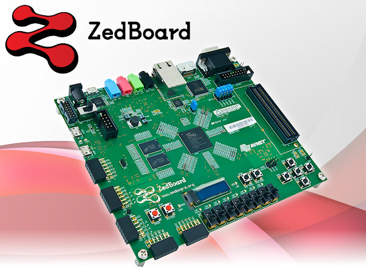

# DLab (Digital System Lab)

DLab is an **implementation-oriented digital design course** offered by **National Yang Ming Chiao Tung University (NYCU)**. Every lab requires participants to independently complete the **RTL** and corresponding **testbench**, covering the entire process from understanding specifications to design implementation and functional verification. The development board I used in the course was the **Digilent ZedBoard**, featuring the Zynq-7000 SoC platform that combines an ARM Cortex-A9 with an FPGA (this lab focused solely on the PL section) using AMD Xilinx Vivado for design and verification.
 
 
Over the course of the semester, I completed **10 labs**. The content covered Verilog RTL coding, FSM design, datapath and controller planning, memory (SRAM) and peripheral module integration, and the establishment of complete testbench writing and verification flows. Starting from simple behavioral descriptions, I eventually progressed to considering architectural choices, resource utilization, and timing constraints based on specifications, gradually developing the ability to transform abstract requirements into synthesizable circuits. Regarding verification, in addition to checking functional correctness through simulation, I also learned to use Vivado ILA (Integrated Logic Analyzer) to observe internal signals during hardware testing, which assisted in debugging and understanding actual hardware behavior.

## Labs

 Labs   | Descriptions
--------|:-----
[Lab1][1]|Sequential Binary Multiplier
[Lab2][2]|3x3 Matrix Multiplier
[Lab3][3]|Simple I/O Control Circuit
[Lab4][4]|UART I/O Circuit
[Lab5][5]|Sieve Algorithm & Standard 1602 Character LCD Display
[Lab7][7]|4x4 Pipelined Matrix Multiplier
[Lab8][8]|MD5 Password Cracking Circuit
[Lab9][9]|Correlation Filter Circuit
[Lab10][10]|VGA Video Interface Circuit

[1]: lab01/
[2]: lab02/
[3]: lab03/
[4]: lab04/
[5]: lab05/
[7]: lab07/
[8]: lab08/
[9]: lab09/
[10]: lab10/

