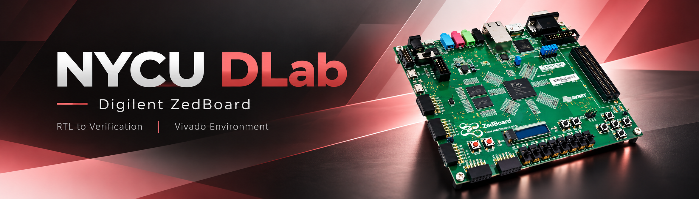

# DLab (Digital System Lab)

DLab is an **implementation-oriented digital design course** offered by **National Yang Ming Chiao Tung University (NYCU)**. Every lab includes **RTL design** and the corresponding **testbench**, covering the entire process from understanding specs to design implementation and functional verification. The development board I used in the course was the **Digilent ZedBoard** and the Xilinx Vivado environment for development.
 
 
Over the course of the semester, I completed **10 labs**, which covered Verilog RTL coding, FSM design, datapath and controller planning, memory (SRAM) and peripheral module integration. I considered architectural choices, resource utilization, and timing constraints based on specifications, gradually developing the ability to transform abstract requirements into synthesizable circuits. In verification, Vivado ILA (Integrated Logic Analyzer) was used alongside simulation to observe internal signals during hardware testing to observe actual hardware behavior.

## Labs

 Labs   | Descriptions
--------|:-----
[Lab1][1]|Sequential Binary Multiplier
[Lab2][2]|3x3 Matrix Multiplier
[Lab3][3]|Simple I/O Control Circuit
[Lab4][4]|UART I/O Circuit
[Lab5][5]|Sieve Algorithm & Standard 1602 Character LCD Display
[Lab7][7]|4x4 Pipelined Matrix Multiplier
[Lab8][8]|MD5 Password Cracking Circuit
[Lab9][9]|Correlation Filter Circuit
[Lab10][10]|VGA Video Interface Circuit

[1]: lab01/
[2]: lab02/
[3]: lab03/
[4]: lab04/
[5]: lab05/
[7]: lab07/
[8]: lab08/
[9]: lab09/
[10]: lab10/

